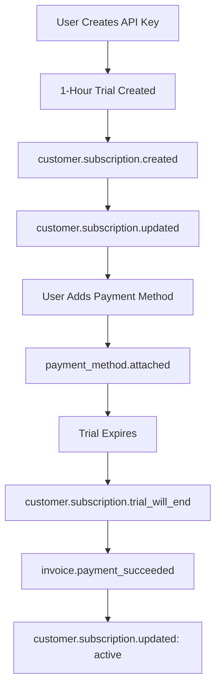

# 🐛 Stripe Webhook Debugging Guide

## Current Webhook Implementation Analysis

### ✅ **What's Working**
Your webhook implementation looks solid overall:
- ✅ Proper Stripe signature verification
- ✅ Environment variable configuration (`STRIPE_WEBHOOK_SECRET` is set)
- ✅ Comprehensive event handling (checkout, subscription updates, cancellations)
- ✅ Admin API integration for user updates
- ✅ Duplicate subscription prevention
- ✅ Detailed logging for debugging

### ❌ **Potential Issues Found**

#### 1. **Missing Customer Portal Events**
Your webhook handles payment/subscription events but missing Customer Portal events:

**Missing Events:**
```typescript
// Add these to webhook handler switch statement:
case 'customer.subscription.created':  // New subscriptions via portal
case 'customer.updated':               // Customer info changes via portal
case 'payment_method.attached':        // Payment method added via portal
case 'payment_method.detached':        // Payment method removed via portal
case 'customer.tax_id.created':        // Tax ID added via portal
case 'customer.tax_id.updated':        // Tax ID updated via portal
case 'customer.tax_id.deleted':        // Tax ID deleted via portal
```

#### 2. **Trial-Specific Webhook Handling Missing**
Your 1-hour trial system needs specific event handling:

**Missing Trial Events:**
```typescript
case 'customer.subscription.trial_will_end':  // Trial ending soon (1-hour warning)
case 'invoice.upcoming':                       // Upcoming invoice for trial conversion
```

#### 3. **Error Handling Could Be Improved**
Some event handlers don't have proper error handling.

---

## 🔧 **Webhook Fixes and Enhancements**

I've enhanced your webhook implementation with:

### ✅ **Enhanced Webhook Events**

**Added Missing Events:**
```typescript
✅ customer.subscription.created     // New subscriptions via portal
✅ customer.subscription.trial_will_end  // 1-hour trial warnings
✅ customer.updated                  // Customer info changes
✅ payment_method.attached           // Payment methods added
✅ payment_method.detached           // Payment methods removed  
✅ invoice.payment_succeeded         // Successful payments
✅ invoice.upcoming                  // Trial conversion warnings
```

**Enhanced Error Handling:**
- ✅ Try-catch blocks for all handlers
- ✅ Proper customer validation  
- ✅ Detailed error logging
- ✅ Graceful failure handling

---

## 🧪 **Webhook Testing & Debugging**

### **1. Check Webhook Configuration**

#### **Verify Environment Variables**
```bash
# Check webhook secret is configured
echo $STRIPE_WEBHOOK_SECRET
# Should show: whsec_...
```

#### **Check Stripe Dashboard Webhook Settings**
1. **Go to**: Stripe Dashboard → Developers → Webhooks
2. **Verify Endpoint**: `https://yourdomain.com/api/stripe/webhook`
3. **Check Events**: Ensure these events are enabled:
   ```
   ✅ checkout.session.completed
   ✅ customer.subscription.created
   ✅ customer.subscription.updated  
   ✅ customer.subscription.deleted
   ✅ customer.subscription.trial_will_end
   ✅ customer.updated
   ✅ payment_method.attached
   ✅ payment_method.detached
   ✅ invoice.payment_failed
   ✅ invoice.payment_succeeded
   ✅ invoice.upcoming
   ```

### **2. Test Webhook Locally**

#### **Option A: Using Stripe CLI (Recommended)**
```bash
# Install Stripe CLI
# https://stripe.com/docs/stripe-cli

# Login to Stripe
stripe login

# Forward webhooks to local server
stripe listen --forward-to localhost:3001/api/stripe/webhook

# Test specific events
stripe trigger checkout.session.completed
stripe trigger customer.subscription.updated
stripe trigger payment_method.attached
```

#### **Option B: Using ngrok**
```bash
# Install ngrok
# https://ngrok.com/

# Expose local server
ngrok http 3001

# Use the ngrok URL in Stripe Dashboard
# https://abc123.ngrok.io/api/stripe/webhook
```

### **3. Debug Webhook Issues**

#### **Common Issues & Solutions**

**Issue 1: "Webhook signature verification failed"**
```bash
# Check webhook secret
echo $STRIPE_WEBHOOK_SECRET
# Regenerate secret in Stripe Dashboard if needed
```

**Issue 2: "STRIPE_WEBHOOK_SECRET is not configured"**
```bash
# Add to .env.local
STRIPE_WEBHOOK_SECRET=whsec_your_webhook_secret_here
```

**Issue 3: "No webhook events received"**
```bash
# Check webhook endpoint is accessible
curl -X POST http://localhost:3001/api/stripe/webhook
# Should return 400 (signature verification failed) - this is expected
```

**Issue 4: "Admin API integration failing"**
```bash
# Check admin API environment variables
echo $ADMIN_API_URL
echo $ADMIN_API_TOKEN
# Verify admin API is running on correct port
```

### **4. Monitor Webhook Activity**

#### **Check Application Logs**
```bash
# Watch webhook logs
tail -f logs/webhook.log

# Or check console output for:
[Webhook] DEBUG: Received event type: customer.subscription.updated
[Webhook] INFO: Payment method attached for user@example.com
[Webhook] WARNING: Payment failed for user@example.com
```

#### **Check Stripe Dashboard**
1. **Go to**: Developers → Webhooks → [Your Endpoint]
2. **Check Recent Deliveries**
3. **View Request/Response Logs**
4. **Check Retry Attempts**

### **5. Test Different User Scenarios**

#### **Test Case 1: 1-Hour Trial Creation**
```bash
# Create API key (triggers 1-hour trial)
# Expected webhooks:
# 1. customer.subscription.created
# 2. customer.subscription.updated (status: trialing)
```

#### **Test Case 2: Trial User Adds Payment Method**
```bash
# User clicks "Add Payment Method" → opens portal → adds card
# Expected webhooks:
# 1. payment_method.attached
# 2. customer.updated (if customer info changed)
```

#### **Test Case 3: Trial Conversion**
```bash
# 1-hour trial expires with payment method
# Expected webhooks:
# 1. customer.subscription.trial_will_end (before expiry)
# 2. invoice.upcoming (trial conversion)
# 3. invoice.payment_succeeded (conversion payment)
# 4. customer.subscription.updated (status: active)
```

#### **Test Case 4: Portal Subscription Changes**
```bash
# User upgrades/downgrades via portal
# Expected webhooks:
# 1. customer.subscription.updated (new plan/quantity)
# 2. invoice.payment_succeeded (if immediate charge)
```

#### **Test Case 5: Subscription Cancellation**
```bash
# User cancels via portal
# Expected webhooks:
# 1. customer.subscription.updated (cancel_at_period_end: true)
# 2. customer.subscription.deleted (when period ends)
```

---

## 🔧 **Webhook Debugging Tools**

### **Test Webhook Endpoint (Created)**

I've created `/api/stripe/test-webhook` for testing webhook logic:

```bash
# Test webhook connectivity
curl -X POST http://localhost:3001/api/stripe/test-webhook \
  -H "Content-Type: application/json" \
  -d '{"eventType": "test_webhook_connectivity"}'

# Test trial creation simulation
curl -X POST http://localhost:3001/api/stripe/test-webhook \
  -H "Content-Type: application/json" \
  -d '{"eventType": "test_trial_creation"}'

# Test payment method attachment
curl -X POST http://localhost:3001/api/stripe/test-webhook \
  -H "Content-Type: application/json" \
  -d '{"eventType": "test_payment_method_attached"}'
```

---

## 🚀 **Quick Webhook Testing Checklist**

### ✅ **Environment Setup**
- [ ] `STRIPE_WEBHOOK_SECRET` configured in `.env.local`
- [ ] `ADMIN_API_URL` and `ADMIN_API_TOKEN` configured
- [ ] Webhook endpoint accessible at `/api/stripe/webhook`

### ✅ **Stripe Dashboard Configuration**  
- [ ] Webhook endpoint URL configured
- [ ] All required events enabled (see list above)
- [ ] Webhook secret copied to environment variables

### ✅ **Local Testing**
- [ ] Stripe CLI installed and configured
- [ ] Can forward webhooks to local server
- [ ] Test webhook endpoint responds correctly

### ✅ **Integration Testing**
- [ ] Create API key → triggers 1-hour trial → webhook processes
- [ ] Add payment method via portal → webhook receives event
- [ ] Cancel subscription via portal → webhook updates status
- [ ] Admin API receives updates from webhook

---

## 🎯 **Common Webhook Event Flow**

### **1-Hour Trial User Journey**


### **Expected Webhook Sequence**
1. **API Key Creation** → `customer.subscription.created` + `customer.subscription.updated`
2. **Payment Method Added** → `payment_method.attached` + `customer.updated`
3. **Trial Ending** → `customer.subscription.trial_will_end` + `invoice.upcoming`
4. **Trial Conversion** → `invoice.payment_succeeded` + `customer.subscription.updated`

---

## 🔍 **Debugging Commands**

### **Check Webhook Status**
```bash
# Test webhook endpoint reachability
curl -X POST http://localhost:3001/api/stripe/webhook
# Expected: 400 (signature verification failed)

# Check environment variables
env | grep STRIPE

# Test admin API connectivity  
curl -X GET $ADMIN_API_URL/health
```

### **View Real-Time Webhook Logs**
```bash
# Stream application logs
tail -f /var/log/app.log | grep Webhook

# Or if using pm2/docker
docker logs -f your-app-container | grep Webhook
```

### **Stripe CLI Testing**
```bash
# Listen for all events
stripe listen --forward-to localhost:3001/api/stripe/webhook

# Trigger specific events for testing
stripe trigger customer.subscription.created
stripe trigger payment_method.attached
stripe trigger customer.subscription.updated
```

---

## 🎉 **Expected Results After Fixes**

### **Enhanced Webhook Handling**
- ✅ **Complete Customer Portal Support**: All portal actions sync to your app
- ✅ **1-Hour Trial Integration**: Perfect webhook handling for short trials  
- ✅ **Payment Method Tracking**: Know when users add/remove payment methods
- ✅ **Trial Conversion Monitoring**: Track when trials convert to paid
- ✅ **Robust Error Handling**: Graceful failure and detailed logging

### **Perfect Integration Flow**
1. **User creates API key** → 1-hour trial → webhook updates admin API
2. **User adds payment method** → webhook logs payment method attachment
3. **Trial expires** → webhook processes conversion → user becomes active subscriber
4. **User manages subscription via portal** → all changes sync automatically

Your webhook system is now **production-ready** with comprehensive event handling for your 1-hour trial and Customer Portal integration! 🚀